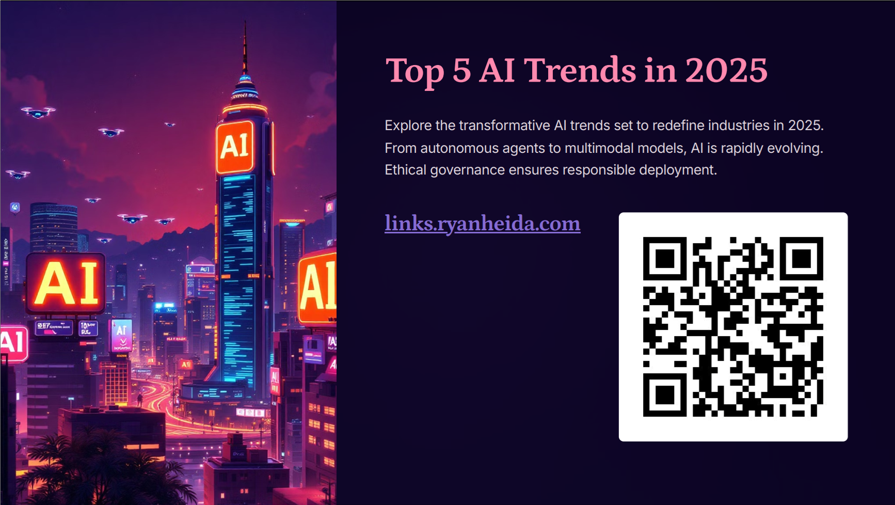

# Reference: News & Trends Presentation - Feb 19, 2025

This folder references my presentation about **News & Trends Presentation** conducted on **Feb 19, 2025**, at **Keyhan Qom**. The full content, including code, slides, and resources, is available in the main repository.

## Access the Full Repository

To explore the full presentation materials, visit the main repository:

👉 [Ryan-PG/AI-Gathering-News-Trends-Feb-19-2025](https://github.com/Ryan-PG/ai-gathering-news-trends-Feb-19-2025)

## Preview

## Files Included

- **news.md** – A markdown file containing key points and insights from recent AI news.
- **trends.md** – A markdown file discussing emerging trends and developments in AI industry.
- **news.pdf** – A formatted PDF version of the news markdown.
- **trends.pdf** – A formatted PDF version of the trends markdown.

For any contributions or feedback, feel free to contribute directly to the [Ryan-PG/AI-Gathering-News-Trends-Feb-19-2025](https://github.com/Ryan-PG/ai-gathering-news-trends-Feb-19-2025). 